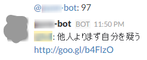

# hubot-97-TEPSK
Show "97 Things Every Programmer Should Know" in hubot

# Description
Post random essay from ["プログラマが知るべき97のこと"](https://ja.m.wikisource.org/wiki/プログラマが知るべき97のこと).



# Installation

In your hubot directory:

```shell-session
npm install --save hubot-97-TEPSK
```
Add hubot-97-TEPSK to external-scripts.json.

```
[
  ... ,
  "hubot-97-TEPSK",
  ...
]
```

# Configuration
* HUBOT_GOOGLE_CSE_KEY
see [Custom Search Engine](https://github.com/hubot-scripts/hubot-google-images/blob/master/README.md#custom-search-engine)

